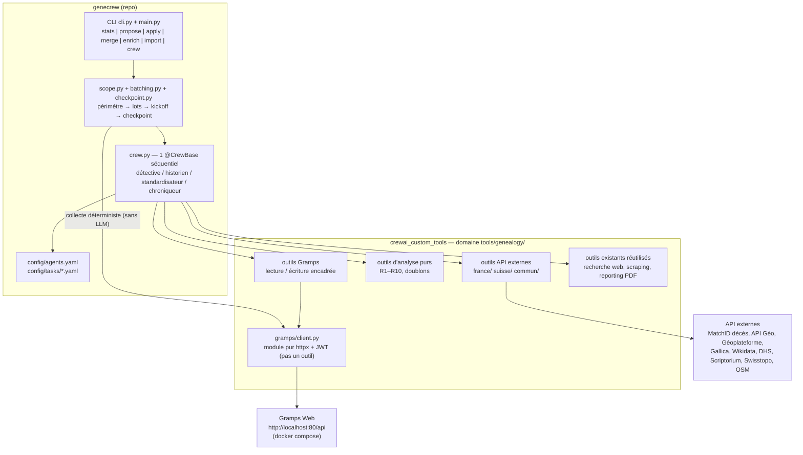

# GeneCrew — Document de travail : équipe d'agents IA pour la généalogie

| | |
| --- | --- |
| **Version** | 1.1 |
| **Date** | 2026-07-20 (v1.0 : 2026-07-17) |
| **Statut** | Conception de référence — voir l'avertissement ci-dessous |
| **Périmètre** | France & Suisse (romande en priorité), étendu à l'Allemagne et aux États-Unis pour les lieux |
| **Backend** | Gramps Web API 3.17.0 (`docs/swagger/openapi.json`) |

> **Portée de ce document.** Il fixe la **vision, les principes et le phasage**. Il n'est
> **pas** la description de l'implémentation : sur tout ce qui est déjà livré, la vérité est
> dans les **ADR** (`docs/adr/`) et dans `CLAUDE.md`, mis à jour à chaque chantier. En cas de
> désaccord entre ce document et un ADR, **l'ADR gagne**.
>
> La v1.1 corrige les dérives de conception constatées le 2026-07-20 (CLI, structure des
> crews, noms de variables, personas) et annote le §9 avec l'avancement réel. Les §1, §2, §4
> et §8 n'ont pas bougé : ils décrivent des invariants toujours respectés.

---

## 1. Contexte et objectifs

### 1.1 Mission

Assister — jamais remplacer — le généalogiste dans son devoir de mémoire. La généalogie est
une discipline de preuve : **aucune donnée non sourcée n'entre dans l'arbre comme fait établi**.
Les agents IA préparent, vérifient, proposent et consignent ; l'humain décide.

### 1.2 Les quatre objectifs

1. **Nettoyer** les données existantes : doublons, incohérences de dates, âges impossibles,
   liens familiaux aberrants.
2. **Standardiser** : lieux (communes fusionnées FR/CH, hiérarchie, coordonnées GPS), dates
   (format Gramps normalisé), noms (variantes de patronymes), titres de sources.
3. **Trouver des pistes de recherche** via les API publiques (INSEE décès, Gallica, Wikidata,
   DHS, Scriptorium…), chaque piste étant sourcée et rejouable.
4. **Fiabiliser** : ne consigner comme vérifié que ce qui est recoupé et cité ; produire des
   notices biographiques à partir des seuls faits prouvés.

### 1.3 Contrainte d'échelle

L'arbre compte entre 1 000 et 5 000 personnes ; le travail est massif et s'étalera sur des
mois. Tout le pipeline est donc conçu pour tourner **par lots**, être **interrompu et repris**
sans perte, et **maîtriser le coût LLM** en confiant le gros du volume à des règles
déterministes gratuites.

---

## 2. Principes directeurs

Chaque principe est normatif et a une conséquence concrète dans ce document.

| Principe | Conséquence concrète |
| --- | --- |
| **KISS** | 4 crews séquentiels simples ; orchestration en Python pur ; CLI argparse ; pas de base de données parallèle ; pas de CrewAI Flows en v1. |
| **DRY** | Toute logique d'accès API vit dans `crewai_custom_tools` (réutilisable au-delà de genecrew) ; un seul client Gramps ; un seul `agents.yaml` ; l'état qualité vit dans Gramps (tags), jamais dupliqué. |
| **Style fonctionnel** | Règles de cohérence, résolution de périmètre, découpage en lots, construction de payloads = fonctions pures (entrées → sorties, sans effet de bord). Les effets (HTTP, fichiers) sont isolés dans le client et les outils. |
| **Preuve avant tout** | Politique d'« écriture directe encadrée » (§ 2.1). Toute citation créée par l'IA est plafonnée à la confiance 2/4. Une piste n'est jamais un fait. |
| **Déterministe d'abord** | Ce qui peut être calculé par du code l'est (règles R1–R10, doublons, géocodage). Le LLM interprète, priorise, contextualise et rédige — il ne calcule pas les anomalies. |
| **Spec-first** | Chaque API dotée d'une déclaration OpenAPI a sa spec copiée dans `docs/swagger/` ; les modèles Pydantic sont générés par `datamodel-code-generator`. |
| **`uv` partout** | `uv sync`, `uv run`, `uv add` — jamais `pip` ni `python` directs. |

### 2.1 Politique d'écriture directe encadrée

- **Écritures autonomes autorisées** : notes, sources, citations, tags qualité — et leur
  **rattachement append-only** à des objets existants (§ 4.5).
- **Interdites aux agents, toujours en proposition pour revue humaine** : suppression, fusion
  — **sauf** la fusion de personnes adossée à une preuve structurelle vérifiable (date de
  naissance complète identique, mêmes parents, conjoint et enfant communs), automatisée par
  `merge people` — modification de tout champ existant d'une personne, famille, événement ou
  lieu (dates, noms, liens de parenté, hiérarchies de lieux…). L'amendement est borné : il ne
  repose sur aucun seuil numérique, et toute paire à preuve partielle repasse par un YAML relu.
  Voir `docs/superpowers/specs/2026-07-20-fusion-doublons-personnes-design.md`.
- La garantie est **structurelle, pas rédactionnelle** : les outils dangereux ne sont câblés à
  **aucun agent** du crew. Un outil de fusion de personnes (`GrampsMergePeopleTool`) existe bien
  dans la bibliothèque depuis `merge people`, mais il n'est donné à aucun agent — il n'est appelé
  que par l'orchestration déterministe `people_merge.py`, hors de portée d'un LLM. Aucune injection
  de prompt ne peut faire faire à un agent ce que ses outils ne permettent pas.
- Ceinture supplémentaire (optionnelle, validée dans les docs CrewAI) : un hook global
  `@before_tool_call` (module `crewai.hooks`) peut bloquer par liste noire tout nom d'outil
  d'écriture pour les crews qui n'en ont pas besoin.

---

## 3. Architecture générale

### 3.1 Vue d'ensemble



### 3.2 Répartition des responsabilités

- **genecrew** : orchestration, personas, tâches, CLI, rapports finaux. Aucune logique d'accès
  API.
- **crewai_custom_tools** : 100 % des outils (Gramps + externes + analyse), avec l'infra
  existante de la bibliothèque : `BaseTool` + `args_schema` Pydantic + décorateur
  `@api_tool(provider, endpoint, timeout)` (timeout, retry 429, rate-limit) + enveloppe
  `ok()/err()` + cache SHA-256 mémoire+disque + tests pytest mockés hors-ligne.
- **Gramps Web** : source de vérité unique. Accès en REST direct (httpx). Le dépôt
  `gramps-mcp` n'est **pas** utilisé à l'exécution ; il sert de spécification de référence
  (auth `auth.py`/`client.py`, catalogue `models/api_calls.py`, schémas `models/parameters/`).

### 3.3 Le client Gramps : un module, pas un outil

`genealogy/gramps/client.py` est un **module Python pur** (httpx + JWT auto-refresh,
fonctions typées par endpoint). Il a deux consommateurs distincts :

1. **L'orchestrateur genecrew, directement et sans LLM** : résolution de périmètre, collecte
   des lots, statistiques. Pas de tokens dépensés pour du déterministe.
2. **Les outils CrewAI**, simples enveloppes `BaseTool` fines autour du client — seuls les
   agents passent par elles, et chacune n'expose que l'opération dont son agent a besoin.

### 3.4 Intégration des dépôts

Les deux dépôts sont frères sous `/Users/fjacquet/Projects/`. Dans le `pyproject.toml`
**racine** de genecrew :

```toml
[project]
dependencies = ["crewai>=1.15.2", "crewai-custom-tools"]

[tool.uv.sources]
crewai-custom-tools = { path = "../crewai_custom_tools", editable = true }
```

> **Note structure (à jour v1.1)** : le scaffold `crewai create crew` avait produit une
> structure imbriquée (`genecrew/genecrew/`), depuis **aplatie**. Le code vit dans
> `genecrew/src/genecrew/`, la configuration uv (`pyproject.toml`, `uv.lock`, `.venv/`, `.env`)
> **à la racine** ; `pyproject.toml` fait le pont via
> `[tool.hatch.build.targets.wheel] packages = ["genecrew/src/genecrew"]`. Tout se lance depuis
> la racine. Le contenu du scaffold (`researcher`/`reporting_analyst`, `{topic}`) a été
> entièrement remplacé.

### 3.5 Arborescence cible de genecrew

Cible **réalisée** (v1.1) — la conception d'origine prévoyait quatre crews séparés et un
`orchestrator.py` ; l'implémentation a convergé vers **un crew** dont on fait varier les
agents, et une orchestration éclatée en modules purs :

```
genecrew/src/genecrew/
  cli.py                   # build_parser() : la grammaire de verbes (ADR 0012)
  main.py                  # dispatch (command, target) + entrées CrewAI run/train/test/replay
  scope.py                 # résolution de périmètre → liste de handles triée (pur)
  batching.py              # découpage en lots (pur)
  checkpoint.py            # lecture/écriture JSON de reprise
  crew.py                  # @CrewBase Genecrew — séquentiel, 4 agents
  crew_audit.py            # orchestration du crew
  audit.py names.py gender.py gender_apply.py apply_all.py       # chantiers déterministes
  places.py places_apply.py places_merge.py lieux_wiki.py lieu_import.py
  deces.py deces_apply.py militaires.py propositions.py pistes.py
  report.py stats.py logging_setup.py
  config/
    agents.yaml            # personas (partagé)
    tasks/audit.yaml       # tâches du crew d'audit
output/                    # rapports + checkpoints + logs (gitignoré)
docs/
  document-de-travail.md   # ce document — vision et phasage
  adr/                     # décisions structurantes — font foi sur l'existant
  swagger/                 # specs OpenAPI vendorées
```

### 3.6 Configuration (variables d'environnement)

Tout dans le `.env` **de la racine**, jamais dans les YAML. Liste complète en Annexe E.
Points clés :

- `MODEL` (LiteLLM) = modèle par défaut ; surcharges par rôle **`MODEL_DETECTIVE`**,
  `MODEL_STANDARDISATEUR`, `MODEL_HISTORIEN`, `MODEL_CHRONIQUEUR` (`MODEL_ARCHIVISTE`,
  multimodal, en phase 6) — **sans** préfixe `GENECREW_`, contrairement à la v1.0. Résolution
  par `build_llm(role)`, **toujours `is_litellm=True`** : le provider natif de CrewAI force
  `"strict": true` sur les schémas d'outils, que Mistral rejette.
- Le fournisseur est **OpenRouter** (`OPENROUTER_API_KEY`), avec un mélange par rôle : un
  modèle de jugement pour le Détective et le Standardisateur, un modèle mécanique pour
  l'Historien et le Chroniqueur.
- `GRAMPS_API_URL=http://localhost:80/api`, `GRAMPS_USERNAME=genecrew-ia`,
  `GRAMPS_PASSWORD=…` — compte dédié, rôle **Editor** (§ 4.6).
- `GENECREW_DRY_RUN` (défaut **`true`**) : tout outil d'écriture devient simulateur — il
  retourne `ok({"dry_run": true, …})` et journalise l'écriture prévue dans le rapport.
- `GENECREW_BATCH_SIZE` (défaut `25`), `GENECREW_OUTPUT_DIR` (défaut `output/`).
- Clés optionnelles des outils existants (`SERPER_API_KEY`, `PERPLEXITY_API_KEY`,
  `GEOAPIFY_API_KEY`) — dégradation gracieuse si absentes.

---

## 4. Modèle de données Gramps et contraintes techniques

Fiche technique à lire avant d'écrire le moindre outil.

### 4.1 Authentification JWT

`POST {GRAMPS_API_URL}/token/` avec `{"username": …, "password": …}` → `access_token` envoyé
en `Authorization: Bearer …`. Rafraîchissement automatique à expiration et sur HTTP 401 (un
seul retry). Modèle éprouvé : `gramps-mcp/src/gramps_mcp/auth.py` et `client.py`.

### 4.2 Endpoints et modèles

- Spec faisant autorité : `docs/swagger/openapi.json` (Gramps Web API 3.17.0, 125 chemins).
- Modèles Pydantic **générés** depuis la spec :

```bash
uv run --with datamodel-code-generator datamodel-codegen \
  --input docs/swagger/openapi.json --input-file-type openapi \
  --output src/crewai_custom_tools/tools/genealogy/models/gramps_generated.py
```

- Les schémas de `gramps-mcp/src/gramps_mcp/models/parameters/` servent de base aux
  `args_schema` des outils (plus compacts que les modèles générés complets).

### 4.2.1 Où vivent les modèles Pydantic

Tous dans `crewai_custom_tools/src/crewai_custom_tools/tools/genealogy/models/` :

| Fichier | Contenu | Origine |
| --- | --- | --- |
| `gramps_generated.py` | objets Gramps Web (Person, Family, Event, Place, Source, Citation, Note, Tag…) | généré depuis `openapi.json` |
| `matchid_generated.py` | requête/réponse MatchID décès | généré depuis `deces-matchid.swagger.json` |
| `geoplateforme_generated.py` | géocodage Géoplateforme | généré depuis `geoplateforme-geocodage.openapi.yaml` |
| `apigeo_generated.py` | communes API Géo | généré depuis `api-geo.definition.yml` |
| `domain.py` | modèles métier écrits à la main : `Proposition`, `Anomalie`, `CandidatDoublon`, `Piste`, `Checkpoint` | manuel |

Règles :

- Les fichiers `*_generated.py` portent un en-tête « généré — ne pas éditer » et se
  régénèrent par la commande documentée ci-dessus (les specs font foi dans
  `genecrew/docs/swagger/` ; dépôts frères, chemin relatif `../genecrew/docs/swagger/`).
- Les `args_schema` de chaque outil restent définis à côté de la classe de l'outil
  (convention existante de la bibliothèque) — volontairement plus compacts que les modèles
  générés, qu'ils réutilisent par import quand c'est pertinent.
- Endpoints utiles au-delà du CRUD : recherche plein texte (`/search/`), timelines, calcul de
  parenté (`/relations/{h1}/{h2}`), OCR (`POST /media/{h}/ocr`), écriture par lots
  (`POST /objects/`), historique (`/transactions/history/`) et **undo**
  (`POST /transactions/history/{id}/undo`). Table complète en Annexe A.

### 4.3 Ordre d'écriture obligatoire

Les événements exigent des citations ; les citations exigent une source. D'où l'ordre :

```
lieu / source  →  citation  →  événement  →  personne  →  famille
```

### 4.4 Format de date Gramps (`dateval`)

`dateval` = `[jour, mois, année, false]` (+ 4 éléments de plus pour un intervalle), avec
`quality` (0 normal, 1 estimé, 2 calculé) et `modifier` (0 exact, 1 avant, 2 après, 3 vers,
4 intervalle, 5 durée, 6 texte seul). Exemples complets en Annexe B. Année seule :
`[0, 0, 1893, false]`.

### 4.5 Sémantique append-only du rattachement

Rattacher une note, un tag ou une citation à un objet existant exige un `PUT` complet.
L'outil `GrampsAttachTool` implémente **exactement** ceci, et rien d'autre :

1. `GET` de l'objet cible (personne, famille, événement…) ;
2. append du handle dans `note_list` / `tag_list` / `citation_list` (jamais de retrait) ;
3. `PUT` de l'objet **sans modifier aucun autre champ**.

C'est le code qui garantit l'encadrement, pas le prompt.

### 4.6 Sécurité côté serveur

- Compte Gramps Web dédié **`genecrew-ia`**, rôle **Editor** (jamais Owner/Admin), créé via
  l'admin Gramps Web avant la Phase 2.
- Toutes les écritures IA sont visibles dans `GET /transactions/history/` (piste d'audit) et
  identifiables par le marqueur de note et les tags `ia-*` (§ 8) — donc purgeables.
- Sauvegarde des volumes docker (export Gramps complet) avant la première écriture réelle de
  chaque phase.

---

## 5. L'équipe d'agents (personas)

Cinq personas. Le moindre privilège est réalisé **par le jeu d'outils** : trois agents sur
cinq n'ont aucun outil d'écriture ; un seul écrit.

> **État v1.1** : **quatre** personas sont implémentés dans `config/agents.yaml` — Détective,
> Historien, Standardisateur, Chroniqueur. L'Archiviste (§5.5) relève de la phase 6 et
> n'existe pas encore. L'outillage effectif de chaque agent a également divergé des listes
> ci-dessous, qui restent la **cible** : voir `crew.py` pour l'attribution réelle.

### 5.1 Détective Généalogique (Corrélateur)

- **role** : Détective généalogique spécialiste de la critique des sources
- **goal** : Détecter toute incohérence, doublon ou fait non prouvé dans le lot analysé, en
  s'appuyant d'abord sur les règles déterministes, puis en éliminant les faux positifs et en
  priorisant les cas par gravité.
- **backstory** : Ancien archiviste départemental passé à la généalogie professionnelle, tu as
  vu trop d'arbres ruinés par des fusions hâtives et des dates recopiées sans preuve. Ta
  devise : « sans acte, pas de fait ». Tu ne modifies jamais rien toi-même : tu instruis le
  dossier.
- **Outils** : lecture Gramps (search, get, list, timeline), `GenealogyConsistencyTool`,
  `DuplicateFinderTool`, `InseeDecesSearchTool`, recherche web (Serper/Perplexity).
- **Écriture** : aucune.

### 5.2 Standardisateur

- **role** : Expert en normalisation de données généalogiques
- **goal** : Proposer pour chaque lieu, date, patronyme et titre de source une forme normalisée
  conforme aux référentiels officiels (API Géo, répertoire des communes suisses, OSM), en
  conservant toujours la forme d'époque en variante.
- **backstory** : Géographe de formation, tu connais l'histoire administrative de la France et
  de la Suisse : fusions de communes, changements de départements, cantons. Tu sais qu'un
  lieu mal normalisé casse les recherches et les cartes ; tu sais aussi qu'écraser le nom
  d'époque détruit l'information historique.
- **Outils** : lecture Gramps, `GeoGouvCommuneTool`, `SwissCommuneTool`,
  `GeoplateformeGeocodeTool`, `GeoapifyPlacesTool` (existant, données OSM),
  `WikidataSparqlTool`.
- **Écriture** : aucune.

### 5.3 Historien Contextuel

- **role** : Historien local spécialiste de la France et de la Suisse romande
- **goal** : Pour chaque personne à lacunes, produire des pistes de recherche sourcées et
  rejouables (URL + requête exacte + degré de correspondance) et éclairer le contexte
  historique (migrations, métiers disparus, guerres, épidémies).
- **backstory** : Chercheur passionné par la presse ancienne et les archives numérisées, tu
  navigues Gallica, le Dictionnaire historique de la Suisse et Scriptorium comme d'autres
  naviguent leur bibliothèque. Une piste n'est pour toi jamais une preuve : c'est une porte à
  ouvrir.
- **Outils** : lecture Gramps, `GallicaSearchTool`, `WikidataSparqlTool`, `HlsDhsSearchTool`,
  `ScriptoriumSearchTool`, `WikipediaSearchTool`, `UnifiedScraperTool`, recherche web.
- **Écriture** : aucune.

### 5.4 Chroniqueur (Biographe-Greffier)

- **role** : Chroniqueur familial et greffier du pipeline
- **goal** : Consigner fidèlement les conclusions de l'équipe : rapports Markdown/PDF,
  notes et tags qualité dans Gramps (append-only strict), création de sources et citations
  dans l'ordre imposé, notices biographiques fondées sur les seuls faits sourcés.
- **backstory** : Écrivain public et greffier méticuleux, tu es le seul de l'équipe autorisé à
  tenir la plume dans le registre. Tu n'écris que ce qui est prouvé, tu cites tout, et tu
  laisses une trace datée de chaque intervention.
- **Outils** : lecture Gramps + `GrampsCreateNoteTool`, `GrampsCreateSourceTool`,
  `GrampsCreateCitationTool`, `GrampsEnsureTagTool`, `GrampsAttachTool` + reporting existant
  (`RenderReportTool`, `HtmlToPdfTool`, `StructuredReportTool`).
- **Écriture** : notes, sources, citations, tags — append-only, `DRY_RUN` respecté.

### 5.5 Archiviste Numérique (phase 6)

- **role** : Archiviste-paléographe numérique
- **goal** : Transcrire les documents numérisés — médias du magasin Gramps **et** documents
  trouvés dans les archives en ligne (Gallica, Scriptorium) — en combinant l'OCR intégré de
  Gramps Web et un LLM à vision pour les manuscrits ; restituer une transcription structurée
  avec proposition de source/citation.
- **backstory** : Paléographe formé aux écritures anciennes (cursive, gothique, latin, vieux
  français), tu travailles exclusivement sur des images numérisées. Tu indiques toujours ton
  degré de certitude de lecture, mot par mot si nécessaire ; un mot douteux est marqué [?],
  jamais inventé.
- **Outils** : lecture Gramps + `GrampsGetMediaFileTool`, `GrampsOcrTool`,
  `VisionTranscriptionTool`, `GallicaSearchTool`, `ScriptoriumSearchTool`, `SwisstopoMapTool`.
- **Écriture** : aucune — ses transcriptions passent par le Chroniqueur.
- **LLM** : `MODEL_ARCHIVISTE`, obligatoirement multimodal (vision).

---

## 6. Les quatre workflows

Chaque workflow = un crew `@CrewBase` séquentiel de 2 agents (l'agent métier + le
Chroniqueur), piloté par l'orchestrateur.

> **État v1.1 — deux écarts à retenir avant de lire ce chapitre.**
>
> 1. **Les commandes citées ci-dessous n'existent plus.** La CLI suit désormais une
>    **grammaire de verbes** (ADR 0012) : `stats`, `propose {audit|places|deaths|military|gender}`,
>    `apply {case|gender|places|citations|all}`, `merge places`, `enrich wiki`, `import place`,
>    `crew audit`. Les anciens noms plats ont été supprimés **sans alias**. Table de
>    correspondance complète dans l'ADR 0012.
> 2. **L'essentiel du travail est déterministe, pas LLM.** Là où ce chapitre décrit un crew,
>    l'implémentation a le plus souvent livré d'abord une commande pure et gratuite
>    (`propose …` / `apply …`), le crew n'intervenant que sur le jugement (`crew audit`).
>    C'est l'application du principe « déterministe d'abord » (§2), pas une déviation.

### 6.1 Workflow 1 — Audit qualité (le socle)

- **Déclencheur** : `uv run genecrew audit --scope <all|I0042|branch:I0042> [--generations N]
  [--batch-size 25] [--resume]`
- **Tâches** (Détective + Chroniqueur) :
  - T1 — collecte du lot (orchestrateur, sans LLM : données étendues des personnes du lot) ;
  - T2 — analyse : exécution de `GenealogyConsistencyTool` et `DuplicateFinderTool`, puis
    interprétation LLM (éliminer les faux positifs évidents, classer par gravité) ;
  - T3 — consignation : tag `ia-anomalie` + note d'audit structurée sur chaque objet concerné ;
    tag `ia-a-verifier` sur les personnes sans aucune citation ;
  - T4 — rapport d'audit + propositions YAML.
- **Règles déterministes R1–R10** (fonctions pures, à coder telles quelles) :

| # | Règle |
| --- | --- |
| R1 | naissance postérieure au décès |
| R2 | âge au décès > 105 ans |
| R3 | mère < 13 ou > 55 ans à la naissance d'un enfant ; père < 13 ou > 80 |
| R4 | mariage avant 13 ans |
| R5 | enfant né après le décès de la mère, ou > 9 mois après celui du père |
| R6 | événement daté hors de la vie de la personne |
| R7 | baptême avant naissance ; inhumation avant décès |
| R8 | dates malformées ou incohérentes (quality/modifier aberrants) |
| R9 | personne ou événement sans source ni citation |
| R10 | candidats doublons : nom normalisé (sans accents, minuscules) + naissance à ±2 ans + `difflib.SequenceMatcher` ≥ 0,85 |

- **Sorties** : `output/audit/AAAA-MM-JJ_audit_<scope>.md` + `…_propositions.yaml`. Écritures
  directes : tags et notes uniquement. (v1.1 : le **PDF WeasyPrint est abandonné** — les
  rapports restent en Markdown, convertis au besoin par pandoc.)
- **Revue humaine** : traitement des propositions dans Gramps Web ; le run d'audit suivant
  constate les anomalies disparues et les marque « résolues ».

### 6.2 Workflow 2 — Standardisation

- **Entrées** : périmètre ou objets tagués par l'audit. Crew : Standardisateur + Chroniqueur.
- **Lieux** : résolution FR via API Géo (communes actuelles, fusions, communes déléguées) et
  CH via le répertoire officiel des communes ; géocodage Géoplateforme / OSM pour lat/long ;
  proposition d'une hiérarchie normalisée `Pays > Région/Canton > Département > Commune >
  Lieu-dit`, **nom d'époque conservé en variante**. Modifier un lieu = donnée cœur →
  **proposition uniquement**.
- **Dates** : conversion des dates textuelles en `dateval` normalisé → propositions.
- **Noms** : détection des variantes orthographiques d'un patronyme → note de variantes
  proposée.
- **Sources** : titre normalisé proposé `AD <dépt> — <commune> — <type d'acte> <années> —
  <cote>`.
- **Sorties** : rapport + propositions YAML ; écritures directes : note descriptive de la
  proposition attachée à l'objet + tag `ia-a-verifier`.

### 6.3 Workflow 3 — Pistes de recherche

- **Entrées** : personnes à lacunes (décès manquant, parents inconnus, périodes vides),
  détectées par l'audit. Crew : Historien + Chroniqueur.
- **Tâches** : T1 identifier les lacunes par personne ; T2 interroger les API (MatchID pour
  les décès France ≥ 1970 en recherche floue ; Wikidata ; DHS pour la Suisse ; Gallica et
  Scriptorium évalués, voir `docs/BACKLOG.md` ; recherche web) ; T3 rapport Markdown de pistes,
  fortes et faibles séparées, degré de correspondance et requête exacte rejouable pour chacune.
- **État réel (2026-07-20)** : `propose wikidata`/`propose dhs` sont **lecture seule** —
  aucune note ni tag n'est posé, conformément à la règle « proposer = lecture seule » (ADR
  0012). Une version antérieure consignait les pistes fortes en note + tag `ia-piste` ; ce
  chemin d'écriture existe encore dans le code (`genecrew/pistes.py` : `consigner`, `marqueur`,
  …) mais n'a plus d'appelant — la mesure sur l'arbre réel n'a produit aucune piste forte à
  consigner. Il est gelé, pas supprimé : une future commande `apply pistes` le réintroduira le
  jour où une source en produit. Détail dans `docs/BACKLOG.md`.
- **Règle de preuve** : une piste n'est jamais un fait — **aucune citation créée à ce stade**.

### 6.4 Workflow 4 — Fiabilisation et rédaction

- **Entrées** : personnes des WF1–3 dont les faits sont confirmés (par l'humain, ou par
  correspondance forte multi-sources). Crew : Détective (recoupement) + Chroniqueur.
- **Tâches** : T1 recoupement final des faits contre leurs preuves ; T2 création des objets de
  preuve dans l'ordre obligatoire (source → citation), puis rattachement append-only de la
  citation aux événements, **confiance plafonnée à 2/4** ; T3 tag `ia-verifie` sur les faits
  sourcés ; T4 notice biographique (note attachée à la personne + chapitre du rapport PDF
  familial).
- Seul workflow qui crée des sources/citations. Tout ce qui exigerait de modifier un champ
  cœur reste une proposition.

### 6.5 Orchestration : périmètre, lots, reprise, coûts

- **Périmètre** (`scope.py`, pur) : `--scope all` (personnes paginées triées par gramps_id),
  `--scope I0042` (une personne), `--scope branch:I0042 --generations N` (ascendants +
  descendants via relations/timeline). Tri déterministe → lots de `GENECREW_BATCH_SIZE`.
- **Checkpoint** : `output/checkpoints/<workflow>_<scope>.json` =
  `{workflow, scope, batch_size, handles_traites, lot_courant, demarre_le, maj_le}` ; écrit
  après chaque lot (`@after_kickoff`), lu par `--resume`. Interruption sans perte à tout
  moment.
- **Coûts** : le volume passe par les outils déterministes et le cache de la bibliothèque ;
  mesure tokens/lot en Phase 1 pour extrapoler le coût d'un run complet avant de le lancer ;
  multi-modèle par agent pour descendre en gamme sur les tâches simples.
- **Note CrewAI** (API validées dans la doc officielle) : la boucle de lots appelle
  `crew().kickoff(inputs={…})` une fois par lot dans notre propre boucle Python —
  `kickoff_for_each` existe mais est écarté car le checkpoint doit être écrit entre deux
  lots, sous notre contrôle. Le hook `@after_kickoff` (module `crewai.project`) sert à
  déclencher l'écriture du checkpoint.

---

## 7. Inventaire des outils

Tous dans `crewai_custom_tools/src/crewai_custom_tools/tools/genealogy/`, sous-répertoires
`{gramps, analysis, france, suisse, commun}/`, suivant le patron de la bibliothèque
(`BaseTool` + `args_schema` + `@api_tool` + `ok()/err()` + cache + tests mockés + export
`__all__`). `GENECREW_DRY_RUN` est implémenté **dans les outils d'écriture eux-mêmes** (une
seule vérification, DRY).

### 7.0 Fondation (pas un outil CrewAI)

| Module | Rôle | Priorité |
| --- | --- | --- |
| `genealogy/gramps/client.py` | client httpx + JWT auto-refresh, fonctions typées par endpoint ; consommé par l'orchestrateur (sans LLM) et par les outils | **P1** |
| `genealogy/models/` | modèles Pydantic générés des specs + `domain.py` (détail § 4.2.1) | P1 |

### 7.1 Outils Gramps

| Outil | Endpoint | Priorité | Agent(s) |
| --- | --- | --- | --- |
| `GrampsSearchTool` | `GET /search/` | P1 | tous |
| `GrampsGetObjectTool` (type + handle/gramps_id + extend) | `GET /{type}/{handle}` | P1 | tous |
| `GrampsListPeopleTool` (pagination, tri) | `GET /people/` | P1 | Détective |
| `GrampsTreeStatsTool` | `GET /trees/`, `/facts/` | P1 | CLI stats |
| `GrampsTimelineTool` | `GET /people/{h}/timeline` | P1 | Détective, Historien |
| `GrampsCreateNoteTool` | `POST /notes/` | P1 | Chroniqueur |
| `GrampsEnsureTagTool` (get-or-create) | `GET+POST /tags/` | P1 | Chroniqueur |
| `GrampsAttachTool` (append-only) | `GET+PUT` | P1 | Chroniqueur |
| `GrampsCreateSourceTool` | `POST /sources/` | P2 | Chroniqueur |
| `GrampsCreateCitationTool` | `POST /citations/` | P2 | Chroniqueur |
| `GrampsGetMediaFileTool` | `GET /media/{h}/file` | P3 | Archiviste |
| `GrampsOcrTool` | `POST /media/{h}/ocr` | P3 | Archiviste |

### 7.2 Outils d'analyse (purs, hors-ligne, gratuits)

| Outil | Contenu | Priorité | Agent |
| --- | --- | --- | --- |
| `GenealogyConsistencyTool` | règles R1–R9 | P1 | Détective |
| `DuplicateFinderTool` | R10 (stdlib `difflib`) | P1 | Détective |

### 7.3 Outils API externes

| Outil | API | Auth | Priorité | Agent(s) |
| --- | --- | --- | --- | --- |
| `GeoGouvCommuneTool` | geo.api.gouv.fr (spec : `api-geo.definition.yml`) | sans clé | P1 | Standardisateur |
| `InseeDecesSearchTool` | deces.matchid.io (spec : `deces-matchid.swagger.json`) | sans clé (~100 appels, token gratuit au-delà) | P2 | Détective, Historien |
| `GeoplateformeGeocodeTool` | data.geopf.fr/geocodage (spec : `geoplateforme-geocodage.openapi.yaml`) — **remplace api-adresse, décommissionnée janv. 2026** | sans clé, 50 req/s | P2 | Standardisateur |
| `SwissCommuneTool` | répertoire officiel des communes (opendata.swiss) | sans clé | P2 | Standardisateur |
| `WikidataSparqlTool` | query.wikidata.org | sans clé | P2 | Historien, Standardisateur |
| `GallicaSearchTool` | Gallica BnF, protocole SRU/CQL | sans clé | P2 | Historien, Archiviste |
| `HlsDhsSearchTool` | DHS via mapping Wikidata | sans clé | P3 | Historien |
| `ScriptoriumSearchTool` | BCUL, OAI-PMH | sans clé | P3 | Historien, Archiviste |
| `SwisstopoMapTool` | api3.geo.admin.ch (docs HTML, pas d'OpenAPI) | sans clé | P3 | Historien, Archiviste |
| `VisionTranscriptionTool` | LLM vision via LiteLLM (`MODEL_ARCHIVISTE`) | clé LLM | P3 | Archiviste |

### 7.4 Outils existants réutilisés tels quels

`PerplexitySearchTool`, `SerperSearchTool`, `WikipediaSearchTool`, `UnifiedScraperTool`,
`GeoapifyPlacesTool`, `RenderReportTool`, `HtmlToPdfTool`, `StructuredReportTool`,
`SaveToRagTool`.

### 7.5 Optimisation (P2+)

Écriture par lots via `POST /objects/` quand plusieurs objets sont créés dans une même
transaction (ex. source + citation + note d'un même dossier).

---

## 8. Modèle qualité et provenance

### 8.1 Tags (état du pipeline, stocké dans Gramps — pas de base parallèle)

| Tag | Signification | Posé par | Levé par |
| --- | --- | --- | --- |
| `ia-anomalie` | incohérence détectée (R1–R8) | audit | humain (ou audit suivant si résolue) |
| `ia-a-verifier` | donnée non sourcée ou proposition en attente | audit, standardisation | humain |
| `ia-piste` | piste de recherche disponible en note (chemin gelé, aucun appelant actif — voir `docs/BACKLOG.md`) | pistes | humain |
| `ia-verifie` | fait recoupé, sourcé, confirmé | fiabilisation | — |

Préfixe `ia-` réservé au pipeline ; création via `GrampsEnsureTagTool` (idempotent).

### 8.2 Confiance des citations

Échelle Gramps 0–4 (0 très faible … 4 très haute). **Règle ferme : toute citation créée par
l'IA est plafonnée à 2 (« Normale »)** ; seule la revue humaine peut monter à 3–4.

### 8.3 Marqueur des notes IA

Première ligne de toute note créée par le pipeline :

```
[genecrew:<workflow>:<AAAA-MM-JJ>:<agent>]
```

puis contenu Markdown. Combiné aux tags et à l'historique des transactions, il rend toute
écriture IA retrouvable, filtrable et purgeable.

### 8.4 Format des propositions (boucle humaine rapide)

Modèle Pydantic `Proposition`, sérialisé YAML (machine-lisible) et rendu en tableau Markdown
trié par priorité (humain-lisible) avec lien direct `http://localhost/person/<gramps_id>` :

```yaml
- type_objet: person
  gramps_id: I0042
  handle: abc123def
  probleme: "R2 : âge au décès de 143 ans (naissance 1801, décès 1944)"
  proposition: "corriger la date de décès en 1844 (acte AD74 4E 123 p. 56, vue en piste)"
  preuves:
    - "https://…/registre…#p56"
  priorite: haute      # haute | moyenne | basse
  confiance: 0.9       # 0–1
```

Le YAML rend possible un futur script d'application semi-automatique des propositions
validées (hors périmètre v1, évolution notée).

---

## 9. Phasage

Règle transverse : **aucune phase ne démarre tant que la précédente n'a pas passé son critère
de sortie sur l'arbre réel.**

| Phase | Livrable | Critère de sortie |
| --- | --- | --- |
| **0 — Plomberie** | `genealogy/gramps/` lecture seule + client JWT + modèles générés + dépendance genecrew→bibliothèque + CLI `genecrew stats` | `uv run genecrew stats` affiche les statistiques identiques au tableau de bord Gramps Web |
| **1 — Audit lecture seule** | crew audit + R1–R10 + rapport MD + checkpoints, `DRY_RUN=true` | rapport sur une branche de ~25 personnes ; anomalies confrontées aux problèmes connus ; faux positifs acceptables ; coût/lot mesuré |
| **2 — Écritures encadrées** | note/tag/attach + compte `genecrew-ia` Editor + `DRY_RUN=false` | tags et notes visibles dans Gramps Web ; l'historique des transactions ne montre que des POST notes/tags et des PUT append-only |
| **3 — Standardisation** | crew standardisation + outils géo FR/CH | propositions correctes sur des communes fusionnées connues de l'arbre (échantillon validé à la main) |
| **4 — Pistes** | crew pistes + MatchID, Gallica, Wikidata | retrouve au moins un décès post-1970 connu ; pistes jugées utiles par l'utilisateur |
| **5 — Fiabilisation** | sources/citations + notices biographiques + PDF familial | chaîne source→citation→rattachement conforme ; confiance ≤ 2 ; récit validé |
| **6 — Archiviste Numérique** | outils média + OCR + vision | transcription correcte d'un acte test du magasin de médias, consignée en note |

### 9.1 Avancement au 2026-07-20

| Phase | État | Ce qui le prouve / ce qui manque |
| --- | --- | --- |
| **0** | ✅ terminée | `stats`, client JWT, modèles générés |
| **1** | ✅ terminée | R1–R10 + D1–D3, `propose audit`, checkpoints, `crew audit` (ADR 0006) |
| **2** | ✅ terminée | note/tag append-only, `effective_dry_run`, ADR 0001 |
| **3** | ✅ **dépassée** | résolveurs FR/CH **et** DE/US (hors périmètre initial), ex-communes fusionnées avec placerefs datées, `merge places`, GPS ; casse des noms (ADR 0007), genre (ADR 0008/0009), lieux (ADR 0010). Restent non traités : normalisation des **dates textuelles** et des **titres de sources** |
| **4** | 🟡 **en cours** | MatchID décès ✅ (critère de sortie atteint) via `propose deaths`/`apply citations` — un circuit séparé qui produit des `PropositionAudit`, pas des `Piste` (`pistes_matchid` existe dans la bibliothèque mais n'a aucun appelant en production, voir `docs/BACKLOG.md`). Contrat `Piste` ✅ (marqueur, idempotence, force dérivée, rapport fortes/faibles). Deux sources `Piste` livrées sous `propose` : **`propose wikidata`** (seule source à produire des pistes fortes ; réserve de couverture — personnes notables seulement, rendement faible attendu sur un arbre ordinaire) et **`propose dhs`** (projection de Wikidata via la propriété P902, Suisse entière, 122 personnes de l'arbre concernées). Toutes deux **lecture seule** : aucune écriture, y compris pour les pistes fortes (chemin de consignation gelé, voir `docs/BACKLOG.md`). Gallica reste dans la bibliothèque, volontairement sans feuille CLI (SRU = notices de collection, pas d'articles ; sous-projet à part, voir `docs/BACKLOG.md`) ; Scriptorium a été écarté (9 personnes, accès non documenté, voir `docs/BACKLOG.md`). **Mode d'emploi dans `docs/USER_GUIDE.md`. Critère de sortie non encore évalué** : « pistes jugées utiles par l'utilisateur » dépend d'une mesure sur l'arbre réel, pas encore faite — à confirmer avec le propriétaire de l'arbre avant de passer la phase à ✅ |
| **5** | 🟡 **partielle** | chaîne source→citation→rattachement ✅ avec confiance plafonnée à 2 (ADR 0011, `apply citations`, éprouvée sur les propositions militaires). **Manquent : notices biographiques et rapport familial** |
| **6** | ⬜ non commencée | ni agent Archiviste, ni OCR, ni transcription par vision |

**Prochain incrément** : mesurer le rendement réel de `propose wikidata`/`propose dhs` sur
l'arbre complet et faire trancher le critère de sortie de la phase 4 par le propriétaire de
l'arbre. Le sous-projet Gallica (`services/ContentSearch`, deux étapes) reste ouvert, voir
`docs/BACKLOG.md`.

---

## 10. Vérification et tests

- **Tests unitaires** (crewai_custom_tools) : 100 % hors-ligne/mockés selon la convention
  existante — mock httpx, assertions sur l'enveloppe JSON, au minimum un test succès + un test
  erreur par outil. Les règles R1–R10 étant pures, elles se testent par tables de cas (dates
  partielles, années seules, calendriers, modificateurs).
- **Tests d'intégration** (genecrew) : `tests/` couvrant les fonctions pures (scope, lots,
  checkpoints, `resolve_llm`) ; smoke test live optionnel derrière une variable d'env contre
  le Gramps Web local.
- **Procédure terrain par phase** : toujours `DRY_RUN=true` sur 1 lot → lecture du rapport →
  `DRY_RUN=false` sur le même lot → vérification dans l'UI **et** dans
  `GET /transactions/history/`.
- **Réversibilité** : sauvegarde des volumes docker avant le premier run en écriture de
  chaque phase ; écritures IA identifiables (marqueur + tags + historique) donc purgeables ;
  `POST /transactions/history/{id}/undo` en dernier recours.

---

## 11. Documentation du projet

Le projet suit la même discipline documentaire que `crewai_custom_tools` (PRD, USER_GUIDE,
ADR). Tout vit dans `genecrew/docs/`.

| Document | Contenu | Quand |
| --- | --- | --- |
| `docs/document-de-travail.md` | ce document — **vision, principes, phasage**. Ne décrit pas l'implémentation | révisé quand la vision ou le phasage bouge, pas à chaque chantier |
| `docs/adr/NNNN-*.md` | **font foi sur l'existant** — chaque décision structurante livrée | à chaque chantier (règle ci-dessous) |
| `CLAUDE.md` | l'état réel du dépôt : structure, commandes, pièges | à chaque chantier |
| `docs/PRD.md` | le « pourquoi/quoi » produit : mission, utilisateurs, objectifs, non-objectifs (dérivé du § 1) | avant Phase 0 |
| `docs/USER_GUIDE.md` | comment lancer chaque workflow, lire les rapports, traiter les propositions, gérer `DRY_RUN` | complété **à chaque phase** — une phase n'est pas terminée si son mode d'emploi n'y est pas |

Les cinq ADR initiaux (0001–0005), qui tracent les décisions de ce document, **sont écrits**,
ainsi que sept autres au fil des chantiers :

| ADR | Décision |
| --- | --- |
| 0001 | écriture directe encadrée — écrivain unique, append-only |
| 0002 | accès Gramps REST direct (gramps-mcp = référence, pas runtime) |
| 0003 | outils dans `crewai_custom_tools`, genecrew simple consommateur |
| 0004 | spec-first, génération Pydantic, specs vendorées |
| 0005 | déterministe d'abord, orchestration Python hors CrewAI |
| 0006 | audit déterministe sur `PersonFacts` |
| 0007 | standardisation de la casse sous invariant « casse seule » |
| 0008 / 0009 | genre : proposition, puis écriture directe à haute confiance |
| 0010 | écriture de la hiérarchie des lieux |
| 0011 | citations INSEE décès via `apply citations` |
| 0012 | grammaire de verbes de la CLI |

Règle : **toute nouvelle décision structurante = un ADR** — pas de décision uniquement dans
une conversation ou un commit.

---

## 12. Annexes

### A. Endpoints Gramps Web utilisés

| Méthode | Endpoint | Usage |
| --- | --- | --- |
| POST | `/token/` | authentification JWT |
| GET | `/trees/{id}`, `/facts/` | statistiques |
| GET | `/search/` | recherche plein texte |
| GET | `/people/`, `/people/{h}` | liste/détail personnes |
| GET | `/families/{h}`, `/events/{h}`, `/places/{h}`, `/sources/{h}`, `/citations/{h}`, `/notes/{h}`, `/media/{h}` | détails objets |
| GET | `/people/{h}/timeline` | chronologie d'une personne |
| GET | `/relations/{h1}/{h2}` | calcul de parenté (périmètre branche) |
| POST | `/notes/`, `/tags/`, `/sources/`, `/citations/` | écritures encadrées |
| PUT | `/people/{h}`, `/events/{h}`, … | **uniquement** via `GrampsAttachTool` (append-only) |
| POST | `/objects/` | écriture par lots (P2+) |
| GET | `/media/{h}/file` ; POST `/media/{h}/ocr` | Archiviste |
| GET | `/transactions/history/` ; POST `…/{id}/undo` | audit & réversibilité |

### B. Exemples de payloads

Date exacte (14 juillet 1893) :

```json
{"dateval": [14, 7, 1893, false], "quality": 0, "modifier": 0}
```

« Vers 1850 » : `{"dateval": [0, 0, 1850, false], "quality": 1, "modifier": 3}`
Intervalle 1850–1855 : `{"dateval": [0,0,1850,false,0,0,1855,false], "quality": 0, "modifier": 4}`

Note d'audit :

```json
{"type": "General", "text": "[genecrew:audit:2026-07-17:detective]\n**R2** — âge au décès de 143 ans…"}
```

Citation (confiance plafonnée) :

```json
{"source_handle": "b39fe…", "page": "vue 56, acte n° 12", "confidence": 2}
```

### C. Gabarit du rapport d'audit

```markdown
# Audit qualité — <scope> — AAAA-MM-JJ
## Synthèse            <!-- N personnes, N anomalies (haute/moyenne/basse), N doublons -->
## Anomalies par gravité   <!-- tableau : ID (lien Gramps Web), règle, détail, proposition -->
## Candidats doublons      <!-- paires, score, éléments concordants/divergents -->
## Personnes sans sources  <!-- liste taguée ia-a-verifier -->
## Écritures effectuées    <!-- ou simulées si DRY_RUN : tags posés, notes créées -->
## Coût du run             <!-- tokens, durée, lots traités -->
```

### D. Glossaire

| Terme | Définition |
| --- | --- |
| **handle** | identifiant technique interne Gramps (opaque, stable) |
| **gramps_id** | identifiant lisible (I0042, F0007, E0123…), affiché dans l'UI |
| **source** | le document (registre paroissial, recensement…) |
| **citation** | la référence précise à un endroit d'une source (page, vue, acte) |
| **commune déléguée** | ancienne commune conservée au sein d'une commune nouvelle (FR) |
| **dateval** | représentation structurée des dates Gramps (§ 4.4) |
| **GQL** | Gramps Query Language, langage de filtre de l'API `/search` structurée |

### E. Variables d'environnement

| Variable | Défaut | Rôle |
| --- | --- | --- |
| `MODEL` | — | modèle LiteLLM par défaut |
| `MODEL_DETECTIVE` / `MODEL_STANDARDISATEUR` / `MODEL_HISTORIEN` / `MODEL_CHRONIQUEUR` | — | surcharge par rôle — **sans** préfixe `GENECREW_` |
| `MODEL_ARCHIVISTE` | — | phase 6, multimodal (vision) requis |
| `OPENROUTER_API_KEY` | — | fournisseur LLM |
| `GRAMPS_API_URL` | `http://localhost:80/api` | base API Gramps Web |
| `GRAMPS_USERNAME` / `GRAMPS_PASSWORD` | — | compte `genecrew-ia` (rôle Editor) |
| `GENECREW_DRY_RUN` | `true` | simule les écritures |
| `GENECREW_BATCH_SIZE` | `25` | taille des lots |
| `GENECREW_OUTPUT_DIR` | `output/` | rapports + checkpoints |
| `SERPER_API_KEY`, `PERPLEXITY_API_KEY`, `GEOAPIFY_API_KEY` | — | optionnelles (outils existants) |
